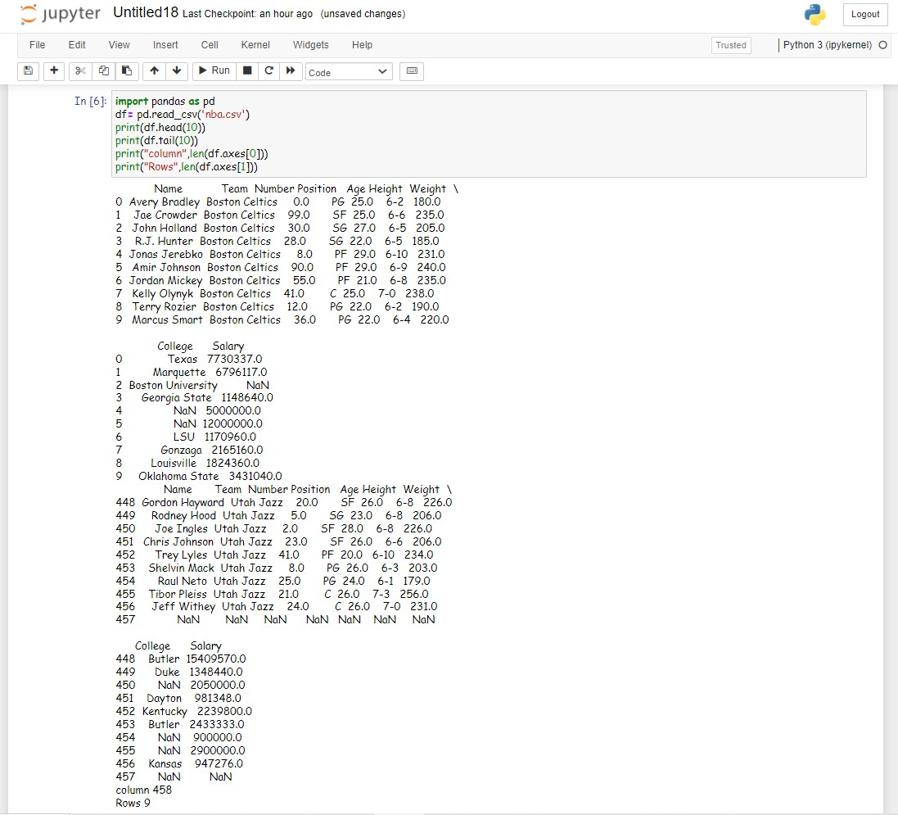

# Read-from csv

### AIM:
To write a python program to read the datas from a CSV file.

### ALGORITHM:
### Step 1:
Download a CSV file

### Step 2:
Open a python platform

### Step 3:
Create a folder in python

### Step 4:
Copy the downloaded CSV file to the python folder and Make a head ansd tail indices 

### Step 5:
 Give the length to axes and Run the program.

### PROGRAM:
~~~
##Program Developed by : Naveenkumar.S
##Reference number : 21500481
import pandas as pd
df = pd.read_csv('nba.csv')
print(df.head())
print(df.tail())
print("Column",len(df.axes[0]))
print("Rows",len(df.axes[1]))
~~~
## OUTPUT:

## RESULT:
Thus a CSV file is read successfully using python programming.